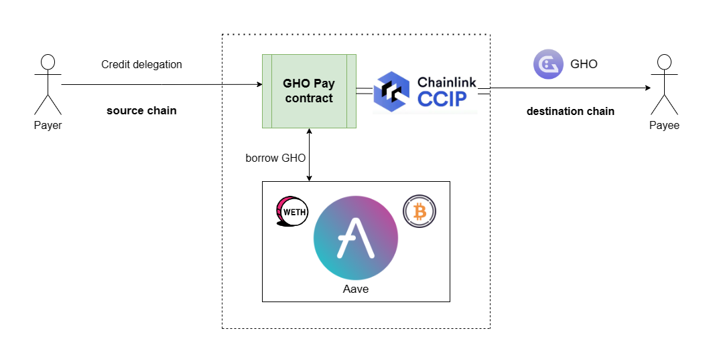

# GHO Pay
Seamless multi-chain GHO stablecoin payments application. GHO payments made super simple!

 

  
 
GHO Pay provides a rapid and effortless way to make stablecoin payments using GHO. It is designed to solve the problems of stablecoin payments in the current scenario. We make use of GHO, a truly decentralized stablecoin and backed by assets on the Aave Protocol, which is the backbone of the project.

GHO Pay allows users to make payments without possessing stablecoin in their wallets. A user can top-up collateral such as ETH/WETH/WBTC etc on GHO Pay, which is in turn supplied to Aave, enabling the user to earn yield on top of it. This collateral is used to borrow GHO later on as when required by the user for payments. They can also repay the borrowed GHO later, allowing users to make immediate payments without having to swap/sell their crypto-assets. Our application also supports cross-chain GHO payments, with the help of Chainlink CCIP. It provides a secure and reliable method for multi-chain payments, thus allowing users to make GHO payments to any supported chain of choice.

## Architecture

 

  

The project abstracts the Aave protocol and Chainlink CCIP. It is made possible using permit and credit delegation, that allows a user to deposit funds in the protocol to earn interest, and delegate borrowing power to the GHO Pay application. The funds deposited by the user on GHO Pay goes to Aave, where they earn interest on top of it. The application also borrows GHO and completes payments on their behalf when required. Chainlink CCIP provides a secure and reliable way for cross-chain GHO transfers. We built a custom token transferor contract for this purpose, with fees paid in LINK. ConnectKit is used for wallet connections and transactions, enabling a seamless user experience.

  

 ## Contract deployments

**Ethereum Sepolia Testnet**

| Contract | Deployment  |
| :----- | :- |
| GHOPay  | [`0x1D16089138D24a4007Ae367ef30568f964b55041`](https://sepolia.etherscan.io/address/0x1D16089138D24a4007Ae367ef30568f964b55041) |
| TokenTransferor | [`0xD55C2C07F84EB397D472C9A562F139e1f8Cbf23F`](https://sepolia.etherscan.io/address/0xD55C2C07F84EB397D472C9A562F139e1f8Cbf23F)|
